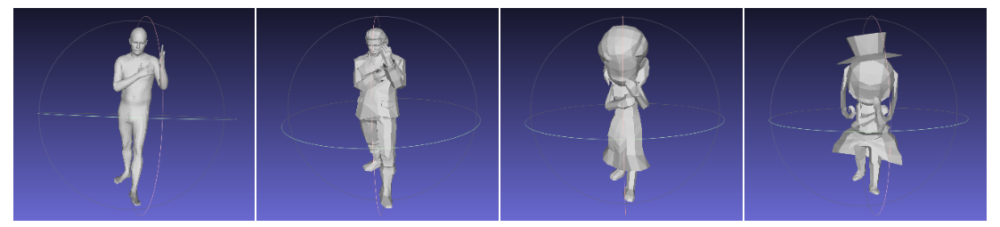

# Pose2Carton 

EE228 课程大作业 利用3D骨架控制3D卡通人物 (https://github.com/yuzhenbo/pose2carton)

数据组别： 28 （刘攀）

数据类型： 10组匹配 + 5组蒙皮

# Maya 环境配置

[**Windows环境**配置](https://zhuanlan.zhihu.com/p/367649237)

1. 将maya下载到一个**全英文**名称文件夹
2. 将maya添加到环境变量中，然后在cmd中安装pip与cmd

# 匹配流程

在对10组模型进行匹配时，只用到了transfer.py。由于要为待匹配的模型匹配一系列的姿态，因此在transfer的main函数中调用的是transfer_one_sequence函数而非transfer_one_frame函数。transfer_one_sequence函数首先读取pkl文件拿到姿态序列，接着调用transfer_given_pose函数，利用前向动力学将姿态迁移到待匹配模型上，生成obj与txt文件。迁移过程中需要**手动匹配关键点**，即补充manual_model_to_smpl字典，这是我们匹配时的主要工作。

完成匹配拿到一系列姿态的模型后，调用vis函数对模型进行可视化。

在对从网上下载的5组模型进行匹配时，首先在maya环境下利用fbx_parser函数解析fbx文件，得到模型的obj、txt以及包含蒙皮信息的mtl文件。接着重复上面的步骤，将姿态序列迁移到模型上，注意将transfer_one_sequence函数里的use_online_model参数设为True，在可视化时也将这个参数设为True。

# 新增脚本说明

由于从其它网站下载的模型与mixamo在格式上存在不一致导致可视化时模型没有蒙皮，因此补充了一个graph_generation.py文件用来给模型加上蒙皮。

程序作用：生成mtl文件中要求的蒙皮图片并重写mtl文件，在其中加上map_Kd。

使用方法：在运行该程序之前，应对模型transfer之后生成的3d_model文件夹进行处理，将其中的mtl文件链接替换为真实mtl文件，然后直接运行该程序。

# 项目结果

最终匹配结果的截图：

# 协议 

本项目在 Apache-2.0 协议下开源

所涉及代码及数据的最终解释权归倪冰冰老师课题组所有

Group 